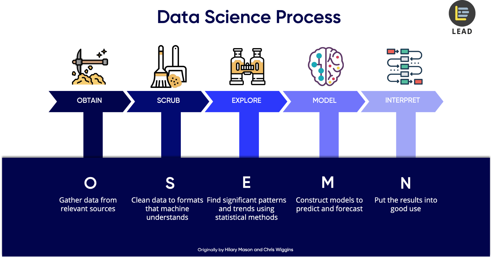

```{r setup, include=FALSE}
knitr::opts_chunk$set(echo = TRUE)
library(tidyverse)
library(DT)
library(dplyr)
library(ggplot2)
```

# INTRODUCTION
Data science is a "concept to unify statistics, data analysis, machine learning and their related methods" in order to "understand and analyze actual phenomena" with data (_WIKIPEDIA_). In simple terms, data science is defined as gather data from the real world, parse the data into machine formats, use the machine to find patterns and trends, use the findings to build model make predictions and forecastings, and lastly, apply to the model to real world. These five steps in data science are also known as data science pipeline and can be abbreviated as Obtain, Scrub, Explore, Model, Interpret (OSEMN).

### Data Science Pipleline


This tutorial will walk through the awesome (OSEMN) steps of data science pipeline using a dataset on _Kaggle_.

Here is the link to the [dataset](https://www.kaggle.com/russellyates88/suicide-rates-overview-1985-to-2016).


# Step 1: Obtain
The dataset on suicide rate from 1985 ro 2016 can be find on [Kaggle](https://www.kaggle.com/). There are other data repositories, such as [data.world](https://data.world/), [data.gov](https://www.data.gov/), [Gapminder](https://www.gapminder.org/data/). 

You can also scrape data from various sources, for example, web pages, emails, documents, and convert the data into csv files. However, we will not cover data extraction in this tutorial.

# Step 2: Srub
### QESTION 1: What are CSV files?
CSV stands for __Comma-Separated Values__. A CSV file stores tabular data in plain text. Each line of the file is a data record. Each record consists of one or more fields, separated by commas (_WIKIPEDIA_). It is a common data exchange format that is widely supported by different scientific operations including R and Python.

In this tutorial, we will use R to perform data management, exploratory data analyis, hypothesis testing and machine learning.
For more imformation about how ingestion of CSV files work, click [here](http://www.hcbravo.org/IntroDataSci/bookdown-notes/ingesting-data.html#structured-ingestion)

### QUESTION 2: How do I load CSV files into R?
To load our dataset, _master.csv_, we need the _read_csv_ function in _tidyverse_ package. 
To include the _tidyverse_ package, we use the command `library(tidyverse)`. To load our dataset, we use the command `read_csv("master.csv")`. 
Note that this csv file contains more than 20 thousand rows, so we use `head()` to display the first 6 rows.
```{r}
library(tidyverse)
head(read_csv("master.csv", col_types = cols()))
```

# Step 3: Explore
Let's first take a look at the original data.
```{r}
db <- read_csv("master.csv")
```
Note that the columns country, sex, age, country-year, genration are parsed into character values, and the rest are parsed into numerical values. There are 12 columns in this table, and each column is an _attribute_. Each column can contain different types of values, but the values within the same column should be the same type.

We also want to know how many row our table has. We can use `nrow(db)` to find out.
```{r}
nrow(db)
```
It contains 27820 rows, and each row is an _entity_.

### Visualize the entire dataset
At the very beginning, we would like to show you how the dataset we chose look like, so you will get a chance to see the entire structure of the dataset, and get a sense of what our dataset is about, and what information it contains.

We can visualize the dataset in a clear way by applying the function 
`datatable(head(db), style="bootstrap", class="table-condensed", options = list(dom = 'tp',scrollX = TRUE))`

This function creates an HTML widget to display rectangular data (a matrix or data frame) using the JavaScript library DataTables.

By using this function, we can easily put the dataset into a data table. The function automatically provide functions such as order by column.

For more information about the function `datatable`, go the the website [Rdocumentation_datatable](https://www.rdocumentation.org/packages/DT/versions/0.5/topics/datatable).
```{r}
datatable(head(db), style="bootstrap", class="table-condensed", options = list(dom = 'tp',scrollX = TRUE))
```

### Getting data needed
In this dataset, we can see that there are 27820 rows. How can we see just one of them.
Let's take a look at the first row. We can select a row from a table by its index using `slice(db, c(1))`.
```{r}
slice(db, c(1))
```
If we want to see the values on the specific index of column, we can use the funciton `select(db, 1)`.
```{r}
select(db,c(1))
```
In these two functions, you may ask why we put '1' in the `c()`. In R, c() means to creat a vector of the values insize, if we want to see more index, we can put them in the vectur and the R will automatically show all of those results.

Example of selecting more than 1 rows
```{r}
slice(db, c(1,4,50))
```

When doing data analysis, it is very likely that we will apply some constraints for the data, such as we only want the data from the year 1987. 

The function `filter()` can help us take out the data we need, and filter out those unnecessary/unrelated data.

In R, we use `==`, `!=`, `>`, `<` to make comparisons. When we want to check if the year is equal to 1987, we can use `year == 1987`.
```{r}
filter(db, year == 1987)
```

### Pipelines of operations
When using R, one of the most important tool you should know and be familiar with is the `pipeline`.

The functions implementing our first set of operations have the same argument/value structure. They take a data frame as a first argument and return a data frame. We refer to this as the __data->transform->data__ pattern. This is the core a lot of what we will do in class as part of data analyses. Specifically, we will combine operation into _pipelines_ that manipulate data frames.

The `dplyr` package introduces syntactic sugar to make this pattern explicit. For instance, we can rewrite our previous example using the ¡°pipe¡± operator `%>%`
```{r}
db %>%
  slice(c(1))
```
__IMPORTANT!__ 
The `%>%` binary operator takes the value to its __left__ and inserts it as the first argument of the function call to its __right__. 
So the expression `LHS %>% f(another_argument)` is equivalent to the expression `f(LHS, another_argument)`.

By using `%>%`, We can combine several steps together.
```{r}
db %>%
  filter(year == 1987) %>%
  slice(c(1))

```
Here, we first select the data for year 1987, then we slice the first row of that dataset.

### Create new attributes.
When dealing with the current dataset, it is common for data scientist to add more necessary attributues based on the current dataset to make it more readable.

Adding more attributes is similar to adding more columns in the data table. The function `mutate` creates new attributes based on the result of a given expression.
```{r}
db %>%
  mutate(ratio = suicides_no / population)
```

### Summarize attribute values over entities
Once we have a set of entities and attributes in a given data frame, we may need to summarize attribute values over the set of entities in the data frame. It collapses the data frame to a single row containing the desired attribute summaries. Such as finding the sum, min, average.

Continuing with the example we used, we may want to know what the minmum, maximum and average suicides_no in the dataset is:
```{r}
summarize(db, min_no=min(suicides_no), mean_no=mean(suicides_no), max_no=max(suicides_no))
```

`Mean`, `Median`, `sd`, `min`, `max`, `n`, `n_distinct`, `any`, `all`, all of these are summarize functions you can use when trying to analyze your dataset.

### Group entities
The `group_by` function in essence annotates the rows of a data frame as belonging to a specific group based on the value of some chosen attributes. This call returns a data frame that is grouped by the value of the `district` attribute.

Remember that __`group_by` function always combined with summarize functions__.
```{r}
db %>% 
  group_by(year) %>%
  summarize(total_suicide = sum(suicides_no))
```
This function will calculate the total amount of suicide number for each year individually.


# Step 4: Model
Data representational modeling is the process of representing/capturing structure in data based on defining:

- __Data model__: A collection of concepts that describes how data is represented and accessed
- __Schema__: A description of a specific collection of data, using a given data model

The purpose of defining abstract data representation models is that it allows us to know the structure of the data/information (to some extent) and thus be able to write general purpose code. Lack of a data model makes it difficult to share data across programs, organizations, systems that need to be able to integrate information from multiple sources. 

A data model typically consists of:

- Modeling Constructs: A collection of concepts used to represent the structure in the data. Typically we need to represent types of _entities_, their _attributes_, types of _relationships_ between entities, and relationship attributes
- Integrity Constraints: Constraints to ensure data integrity (i.e., avoid errors)
- Manipulation Languages: Constructs for manipulating the data

### Plotting with ggplot
Plotting serves many important roles in data analysis. We use it to gain understanding of dataset characteristics throughout analyses and it is a key element of communicating insights we have derived from data analyses with our target audience.

The `ggplot` package is designed to work well with the `tidyverse` set of packages. As such, it is designed around the Entity-Attribute data model. Also, it can be included as part of data frame operation pipelines. 

For more information about `ggplot`, go to the website [ggplot](https://www.rdocumentation.org/packages/ggplot2/versions/3.1.1/topics/ggplot)

Let's first create a dot plot of number of suicides happened in different countries in 1987
```{r}
db %>%
  filter(year == 1987) %>%
  group_by(country) %>%
  summarize(num_suicides= sum(suicides_no)) %>%
  ggplot(mapping=aes(y=country, x=num_suicides)) +
    geom_point()
```

The central design for `ggplot` is very elegant, the central premise is to characterize the building pieces behind ggplot plots as follows:

- The __data__ that goes into a plot, a data frame of entities and attributes
- The __mapping__ between data attributes and graphical (aesthetic) characteristics
- The __geometric representation__ of these graphical characteristics

In general, the `ggplot` call will have the following structure:
`<data_frame> %>%    ggplot(mapping=aes(<graphical_characteristic>=<attribute>))    +    geom_<representation>()`

There are several frequently used plot in R

- Scatter Plot (already shown in the previous example)
- Bar Graph
- Histogram
- Boxplot

#### Bar Graph
Used to visualize the relationship between a continuous variable to a categorical (or discrete) attribute
```{r}
db %>%
  filter(year == 1987) %>%
  group_by(country) %>%
  summarize(num_suicides= sum(suicides_no)) %>%
  ggplot(mapping=aes(x=country, y=num_suicides)) +
    geom_bar(stat="identity")
```

#### Histogram
Used to visualize the distribution of the values of a numeric attribute
```{r}
db %>%
  ggplot(mapping=aes(x=year)) +
    geom_histogram()

```
Because we have too much x values stored, you can see that the histogram are all gathered together, and it's very hard to distinguish them.
So we can either change the binwidth of the graph, or decrease the amount of x values. We can do it by add a filter before we draw the graph.
Such as 
```{r}
db %>%
  filter(year == c(1990,1995,2000,2005,2010)) %>%
  ggplot(mapping=aes(x=year)) +
    geom_histogram()
```


#### Boxplot
Used to visualize the distribution of a numeric attribute based on a categorical attribute
```{r}
db %>%
  filter(country == "Albania")%>%
  ggplot(mapping=aes(x=country, y=suicides_no)) +
    geom_boxplot()
```

### The Entity-Relationship and Relational Models
The fundamental objects in this formalism are _entities_ and their _attributes_, as we have seen before, and _relationships_ and _relationship attributes_. Entities are objects represented in a dataset: people, places, things, etc. Relationships model just that, relationships between entities.

For more information about Entity_Relationship and Relational Models, check [here](https://www.webopedia.com/TERM/E/entity_relationship_diagram.html)

### Tidy Data
Tidy Data refers to datasets that are represented in a form that is amenable for manipulation and statistical modeling.

We want to prepare and organize our data in a way that is amenable for analysis, both in modeling and visualization. We think of a data model as a collection of concepts that describes how data is represented and accessed. 

Here we assume we are working in the [ER data model](https://github.com/umddb/datascience-fall14/blob/master/lecture-notes/models.md) represented as __relations__: rectangular data structures where

- Each attribute (or variable) forms a column
- Each entity (or observation) forms a row
- Each type of entity (observational unit) forms a table

There are several common problems in messy data (in our example, we have _multiple variables stored in one column_)

- Column headers are values, not variable names (gather)
- Multiple variables stored in one column (split)
- Variables stored in both rows and column (rotate)
- Multiple types of observational units are stored in the same table (normalize)
- Single observational unit stored in multiple tables (join)

In our previous example,
```{r}
slice(db,c(1))
```
We can see that there is one column(attribute) specifically designed to store _country-year_. This is a combination of more than 1 attributes. But there are already two separated columns to sotre _year_ and _country_. It's a duplicate of attributes, and it does not follow the rule of ER relationship. To make this dataset tidy, instead of split, we can __delete__ the _country-year_ attribute.
```{r}
db <- db[,-8]
```
For more information about deleting attributes, go to [drop data frame columns by name](https://stackoverflow.com/questions/4605206/drop-data-frame-columns-by-name)


### Handling Missing Data
By missing data we mean values that are unrecorded, unknown or unspecified in a dataset. 

Even though there are no missing data in our example, it's still important to mention it.

In general, the central question with missing data is: Should we remove observations with missing values, or should we impute missing values? This also relates to the difference between values that are missing at random vs. values that are missing systematically. In the weather example above, the first case (of failed measurements) could be thought of as missing at random, and the second case as missing systematically.

Data that is missing systematically can significantly bias an analysis. For example: Suppose we want to predict how sick someone is from test result. If doctors do not carry out the test because a patient is too sick, then the fact test is missing is a great predictor of how sick the patient is.

So in general, the first step when dealing with missing data is to understand why and how data may be missing. I.e., talk to collaborator, or person who created the dataset. Once you know that data is not missing systematically and a relatively small fraction of observations contain have missing values, then it may be safe to remove observations.

There are few major ways of dealing missing data

- Encoding as missing (In the case of categorical attributes, a useful approach is to encode the fact that a value is missing as a __new category__ and include that in subsequent modeling.)
- Imputation (In the case of numeric values, we can use a simple method for imputation where we replace missing values for a variable with, for instance, the __mean__ of non-missing values)
